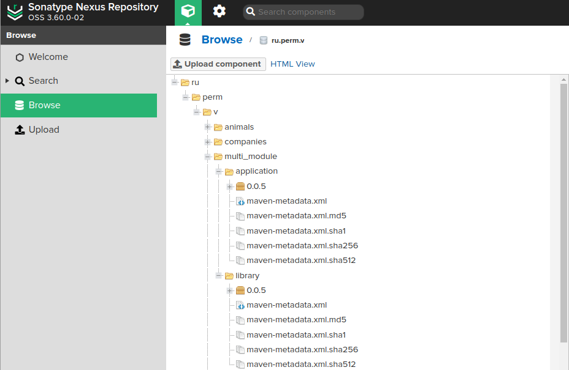

### Проект в Idea


### Порядок выполнения операций в модульном проекте gradle.

````shell
./gradlew build
````

Вывод в консоль:

````text
Module Application. On JavaCompile. Executing TASK: compileJava
----------------
Module Application. On JavaCompile. Executing TASK: compileTestJava
----------------
Module Library. On JavaCompile. Executing TASK: compileJava
----------------
Module Library. On JavaCompile. Executing TASK: compileTestJava
----------------
Module Application. On Test. Executing TASK: test
----------------
Module Library. On Test. Executing TASK: test
----------------
````

Сначала все модули компилируются (On JavaCompile) в след. порядке:

Module __Application__:
<ul>
    <li>compile Application MAIN</li>
    <li>compile Application TEST</li>
</ul>

Module __Library__
<ul>
    <li>compile Library MAIN</li>
    <li>compile Library TEST</li>
</ul>

Затем выполняются тесты (On Test) (т.к. build).
<ul>
    <li>Test Module Application</li>
    <li>Test Module Library</li>
</ul>

### Сборка Jenkins


### Описание артефакта maven


````shell
publishing {
	publications {
		mavenJava(MavenPublication) {
			from components.java
			versionMapping {
				usage('java-api') {
					fromResolutionOf('runtimeClasspath')
				}
				usage('java-runtime') {
					fromResolutionResult()
				}
			}
			pom {
				name = 'Library for Multi Module Project'
				description = 'Description for Multi Module Project'
				url = 'https://github.com/cherepakhin/multi_module'
				properties = [
						myProp: "value",
						"prop.with.dots": "anotherValue"
				]
				licenses {
					license {
						name = 'The Apache License, Version 2.0'
						url = 'http://www.apache.org/licenses/LICENSE-2.0.txt'
					}
				}
				developers {
					developer {
						id = 'vasi.che'
						name = 'Vasili Cherepakhin'
						email = 'vasi.che@gmail.com'
					}
				}
				scm {
					connection = 'scm:git:git://github.com/cherepakhin/multi_module.git'
					developerConnection = 'scm:git:ssh://github.com/cherepakhin/multi_module.git'
					url = 'https://github.com/cherepakhin/multi_module'
				}
			}
		}
	}
	repositories {
		maven {
			url = 'http://v.perm.ru:8081/repository/ru.perm.v/'
			allowInsecureProtocol = true
			credentials {
				username = 'admin'
				password = 'pass'
			}
		}
	}
}

````

В Nexus в файле library-0.0.4.pom будут указаны данные артефакта:

[http://192.168.1.20:8081/repository/ru.perm.v/ru/perm/v/multi_module/library/0.0.5/library-0.0.5.pom](http://192.168.1.20:8081/repository/ru.perm.v/ru/perm/v/multi_module/library/0.0.5/library-0.0.5.pom)


### Раздельный test модулей

````shell
$ ./gradlew :application:test
$ ./gradlew :library:test
````

### Раздельный deploy модулей

````shell
$ ./gradlew :library:publish
$ ./gradlew :application:publish
````

Итог в Nexus:
